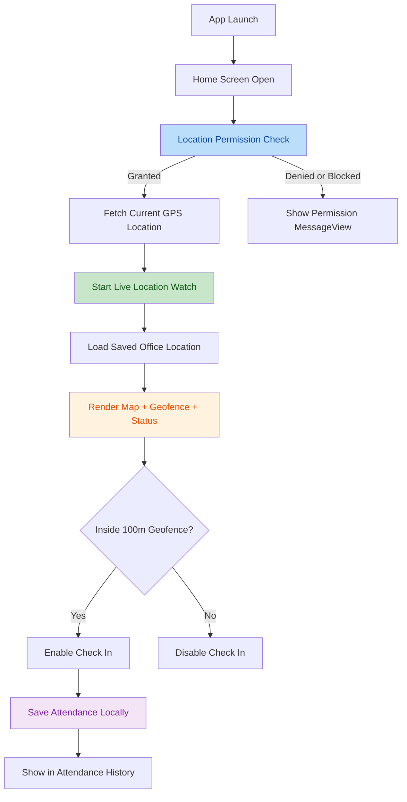
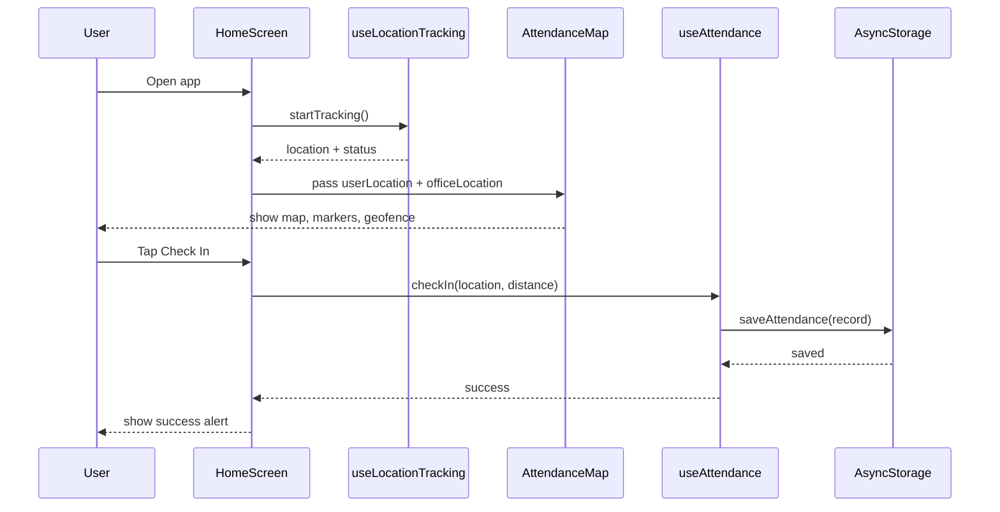
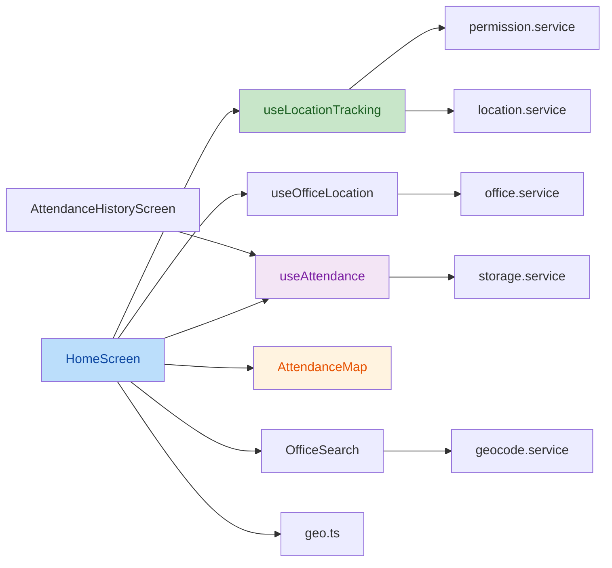

# GeoAttendanceTracker Project Guide

## Purpose

Ye document project ko end-to-end samjhane ke liye banaya gaya hai, taaki koi bhi developer ya reviewer ye quickly samajh sake:

- app kya karti hai
- user flow kya hai
- kaunse modules kis kaam ke liye hain
- kis requirement ko code me kahan implement kiya gaya hai
- app me change karna ho to kis file me kya update karna hai
- given assignment requirements fullfill ho rahi hain ya nahi

## Assignment Summary

Required app:

- Real-time geolocation tracking
- Map par current user location show karna
- Fixed office location with `100 meters` geofence
- Sirf geofence ke andar attendance check-in allow karna
- Attendance locally save karna
- Attendance history screen dena
- Permission, GPS disabled aur offline usage handle karna

## Project Overview

`GeoAttendanceTracker` ek React Native CLI + TypeScript app hai jo user ki live location track karti hai, office geofence ke respect me distance calculate karti hai, aur geofence ke andar hone par attendance check-in allow karti hai.

App me currently ye capabilities hain:

- live GPS tracking
- office search and selection
- persisted office location
- geofence status badge
- map with office and user markers
- 100m radius circle
- attendance history
- local storage
- permission and GPS disabled handling

## High-Level Flow

## Check-In Technical Flow

## Main Screens

### 1. Home Screen

File: `src/screens/HomeScreen.tsx`

Home screen app ka main dashboard hai. Is screen par:

- office search box show hota hai
- selected office details dikhte hain
- geofence status dikhता hai
- latitude, longitude aur distance dikhte hain
- map render hota hai
- check-in button dikhता hai

Home screen ki key responsibilities:

- location hook se current GPS location lena
- office hook se office load karna
- user inside geofence hai ya nahi calculate karna
- check-in enable/disable karna
- GPS disabled, denied, blocked aur error states handle karna

### 2. Attendance History Screen

File: `src/screens/AttendanceHistoryScreen.tsx`

Ye screen stored attendance records ko list karti hai.

Features:

- records newest-first order me
- empty state if no records exist
- clear history action in header

## Module Map

## Important Files And Their Purpose

### App bootstrap

- `App.tsx`
  - app start point
  - navigation container and safe area provider setup

- `src/navigation/RootNavigator.tsx`
  - `Home`
  - `AttendanceHistory`

### Screen layer

- `src/screens/HomeScreen.tsx`
  - main business flow
  - location, geofence, map, check-in orchestration

- `src/screens/AttendanceHistoryScreen.tsx`
  - saved records list

### Hooks

- `src/hooks/useLocationTracking.ts`
  - permission check
  - initial current location fetch
  - continuous watch
  - tracking status updates

- `src/hooks/useAttendance.ts`
  - history load
  - duplicate same-day check-in prevention
  - save and clear attendance

- `src/hooks/useOfficeLocation.ts`
  - office location load and save
  - default office fallback

### Services

- `src/services/location.service.ts`
  - low-level geolocation APIs

- `src/services/permission.service.ts`
  - location permission helpers
  - app settings / device settings open karna

- `src/services/storage.service.ts`
  - attendance records local store

- `src/services/office.service.ts`
  - selected office local store

- `src/services/geocode.service.ts`
  - Google Places autocomplete and place details

### UI Components

- `src/components/AttendanceMap.tsx`
  - office marker
  - user marker
  - geofence circle
  - zoom and focus controls
  - show-both-locations logic

- `src/components/OfficeSearch.tsx`
  - office search UI

- `src/components/CheckInButton.tsx`
  - check-in action button

- `src/components/StatusBadge.tsx`
  - inside or outside geofence status

### Utility Layer

- `src/utils/geo.ts`
  - Haversine distance
  - inside/outside geofence calculation

- `src/utils/date.ts`
  - date key and time formatting

## Data Flow

### Location Flow

1. `HomeScreen` loads
2. `useLocationTracking` permission check karti hai
3. Permission granted ho to `getCurrentPosition()` call hota hai
4. Uske baad `watchPosition()` start hota hai
5. Updated location state `HomeScreen` ko milta hai
6. `HomeScreen` distance aur geofence status recalculate karta hai
7. `AttendanceMap` updated markers render karta hai

### Attendance Flow

1. User geofence ke andar aata hai
2. `Check In` enable hota hai
3. User tap karta hai
4. `useAttendance.checkIn()` call hota hai
5. Same date record pehle se hai to save reject hota hai
6. New record ban kar `AsyncStorage` me save hota hai
7. History screen par record show hota hai

### Office Selection Flow

1. User office search field me text enter karta hai
2. `geocode.service.ts` suggestions fetch karta hai
3. User place select karta hai
4. Place details se coordinates milte hain
5. `useOfficeLocation` selected office save karta hai
6. Map aur geofence us office ke around update ho jate hain

## Data Stored On Device

AsyncStorage keys:

- `@geo_attendance/records`
  - attendance records list

- `@geo_attendance/office_location`
  - selected office location

Attendance record structure:

- `id`
- `date`
- `time`
- `timestamp`
- `latitude`
- `longitude`
- `distance`

## Kahan Kya Change Karna Hai

### Agar office ka default location change karna ho

File: `src/constants/index.ts`

Change:

- `OFFICE_LOCATION`

### Agar geofence radius change karna ho

File: `src/constants/index.ts`

Change:

- `GEOFENCE_RADIUS_METERS`

### Agar map controls ya camera behavior change karna ho

File: `src/components/AttendanceMap.tsx`

Change examples:

- zoom button behavior
- user focus behavior
- office focus behavior
- show-both-locations fit padding

### Agar check-in rules change karni ho

File: `src/hooks/useAttendance.ts`

Change examples:

- duplicate rule
- record fields
- storage logic

### Agar permission ya GPS behavior change karna ho

Files:

- `src/hooks/useLocationTracking.ts`
- `src/services/permission.service.ts`
- `src/services/location.service.ts`

### Agar office search remove ya strict fixed office karna ho

Files:

- `src/screens/HomeScreen.tsx`
- `src/components/OfficeSearch.tsx`
- `src/hooks/useOfficeLocation.ts`

If assignment strictly fixed office demand karta hai, to `OfficeSearch` ko hide/remove karke sirf constant-based office use kiya ja sakta hai.

## Requirement Fulfillment Matrix

| Requirement | Status | Evidence | Notes |
| --- | --- | --- | --- |
| Real-Time Location Tracking | Fulfilled | `useLocationTracking.ts` + `location.service.ts` | Current position aur continuous watch dono implemented hain |
| Map Integration | Fulfilled | `AttendanceMap.tsx` | User and office markers plus geofence circle present |
| Fixed Office Location + 100m Geofence | Fulfilled with extension | `constants/index.ts`, `AttendanceMap.tsx` | Default office fixed hai, radius `100m` hai, lekin app office search bhi allow karti hai |
| Attendance Check-In Inside Geofence Only | Fulfilled | `HomeScreen.tsx`, `CheckInButton.tsx`, `useAttendance.ts` | Outside geofence button disabled hai |
| Local Data Storage | Fulfilled | `storage.service.ts`, `office.service.ts` | AsyncStorage used |
| Attendance History Screen | Fulfilled | `AttendanceHistoryScreen.tsx` | Separate screen available |
| Permission Handling | Fulfilled | `permission.service.ts`, `useLocationTracking.ts`, `HomeScreen.tsx` | denied and blocked flows implemented |
| GPS Disabled Handling | Fulfilled | `HomeScreen.tsx`, `useLocationTracking.ts` | dedicated state and retry/settings flow present |
| Offline Usage Situations | Fulfilled | `storage.service.ts`, `OfficeSearch.tsx`, `geocode.service.ts` | Local storage offline work karti hai aur office search me network/offline failure message bhi show hota hai |

## Requirement-by-Requirement Analysis

### 1. Real-Time Location Tracking

Status: `Fulfilled`

Why:

- current GPS location fetch hoti hai
- continuous location watch start hota hai
- location updates state me reflect hoti hain

Conclusion:

Ye requirement properly implemented hai.

### 2. Map Integration

Status: `Fulfilled`

Why:

- map present hai
- office marker present hai
- user marker present hai
- geofence circle present hai

Conclusion:

Requirement complete hai.

### 3. Geofence Configuration

Status: `Fulfilled with extension`

Why:

- geofence radius `100 meters` defined hai
- office ke around circular region calculate hota hai
- distance Haversine formula se nikalta hai

Important note:

Assignment me fixed office location bola gaya tha. App me fixed default office defined hai, lekin additional feature ke roop me office search and replace bhi diya gaya hai.

Conclusion:

Requirement fail nahi hoti; app required behavior se zyada flexible hai.

### 4. Attendance Check-In

Status: `Fulfilled`

Why:

- geofence ke andar hone par hi button enable hota hai
- same day duplicate check-in prevent hota hai
- success par record save hota hai

Conclusion:

Requirement fully implemented hai.

### 5. Local Data Storage

Status: `Fulfilled`

Why:

- attendance AsyncStorage me save hoti hai
- office location bhi locally save hoti hai

Conclusion:

Requirement complete hai.

### 6. Attendance History Screen

Status: `Fulfilled`

Why:

- separate screen present hai
- stored records list me visible hain

Conclusion:

Requirement complete hai.

### 7. Error And Edge Case Handling

Status: `Fulfilled`

Covered:

- permission denied
- permission blocked
- GPS disabled on initial location fetch
- GPS disabled during active tracking
- generic location errors
- offline local history availability

Conclusion:

Requirement required scope ke hisaab se implemented hai.

## Final Verdict

Overall assessment:

- `8/8` requirement areas implemented hain

Final conclusion:

- App assignment ko overall `successfully satisfy` karti hai
- Current codebase given assignment requirements ko satisfy karti hai

## Recommended Improvements

Ye improvements project ko stronger bana denge:

1. Network status detect karke banner show karo
2. Requirement traceability ke liye screenshots add karo
3. Optional: fixed office-only mode ka config flag add karo
4. Optional: attendance history export ya sync support add karo

## Reviewer Notes

Strict assignment perspective se:

- agar evaluator ko sirf required feature chahiye, app pass karegi
- if fixed office requirement ko literal maana jaye, to office search ko "extra feature" maana jayega, not failure

## Quick Summary

Ye app:

- live location track karti hai
- map par user aur office dikhati hai
- 100m geofence use karti hai
- geofence ke andar hi attendance allow karti hai
- history locally save karti hai
- separate history screen deti hai
- permission aur GPS disabled cases handle karti hai

Notable note:

- office search fixed-office requirement se extra feature hai, gap nahi
